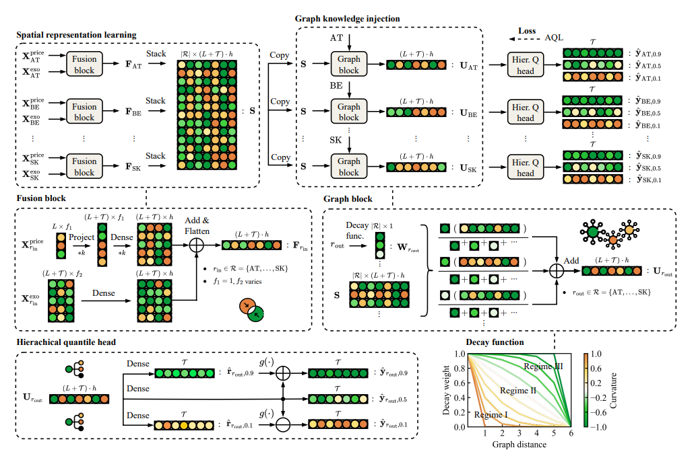

# PriceFM
Foundation Model for Probabilistic Electricity Price Forecasting




---


## 🚀 Quick Start

We open-source all code for preprocessing, modeling, and analysis.  
The project directory is structured as follows:

    PriceFM/
    ├── Data/
    ├── Model/
    ├── Result/
    ├── PriceFM.py
    ├── Main.py
    ├── README.md

The file `README.md` specifies the required package versions.

To facilitate reproducibility and accessibility, we have streamlined the entire pipeline into just three simple steps:

### ✅ Step 1: Prepare the Folder Structure

Create a folder named `PriceFM`, along with subfolders `Data`, `Model`, and `Result`.  
Place the energy dataset `EU_Spatiotemporal_Energy_Data.csv` into `Data`, and place `PriceFM.py` inside the `PriceFM` folder.

### ✅ Step 2: Run the Pipeline

Run `Main.py` to:
- Preprocess the energy data
- Train, validate, and test the PriceFM model

The script `PriceFM.py` contains all necessary functions and classes.

### ✅ Step 3: Check Results

After execution, check:
- `Model/` for saved model weights  
- `Result/` for evaluation metrics and outputs


---


## 📦 Environment & Dependencies

This project has been tested with the following environment:

- **Python 3.9.20**
- `numpy==1.25.2`
- `pandas==2.1.4`
- `scikit-learn==1.5.1`
- `scipy==1.13.1`
- `tensorflow==2.16.2`
- `protobuf>=3.19.0`
- `h5py>=3.1.0`
- `joblib`
- `setuptools`

Use the following comment to pip install:

```bash
pip install numpy==1.25.2 pandas==2.1.4 scikit-learn==1.5.1 scipy==1.13.1 tensorflow==2.16.2 protobuf>=3.19.0 h5py>=3.1.0 joblib setuptools
