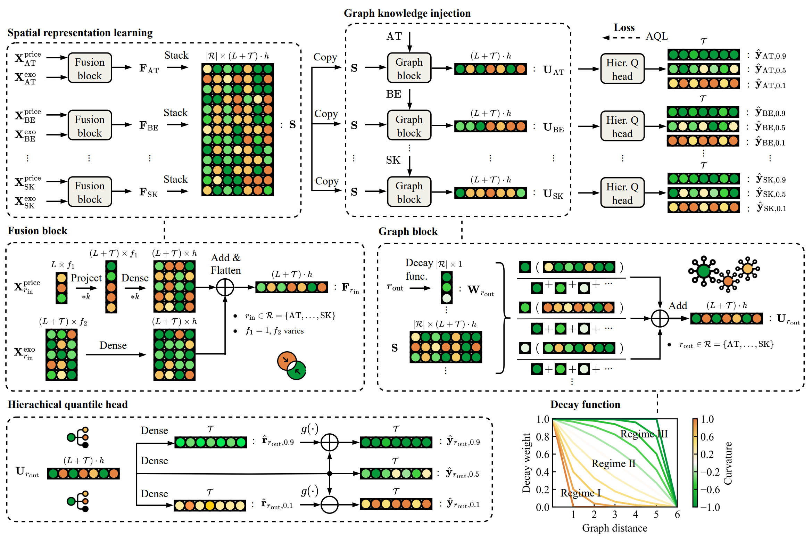

{: style="float:left; height:120px;" }
<div style="clear:both;"></div>

{: style="float:right; height:84px; margin-left:12px;" }
# PriceFM: Foundation Model for Probabilistic Day-Ahead Electricity Price Forecasting
<div style="clear:both;"></div>

[](https://www.arxiv.org/abs/2508.04875)
[](https://github.com/runyao-yu/PriceFM)
[](https://www.linkedin.com/in/runyao-yu/)
[](mailto:runyao.yu@tudelft.nl)

**Authors:** Runyao Yu, Chenhui Gu, Jochen Stiasny, Qingsong Wen, Wasim Sarwar Dilov, Lianlian Qi, Jochen L. Cremer

## Abstract
We introduce a comprehensive and up-to-date dataset across 24 European countries (38 regions), spanning from 2022 to 2025. 

Building on this groundwork, we propose PriceFM, a spatiotemporal foundation model that integrates graph-based inductive biases to capture spatial interdependencies across interconnected electricity markets. The model is designed for multi-region, multi-timestep, and multi-quantile probabilistic electricity price forecasting. 

Extensive experiments and ablation studies confirm the model's effectiveness, consistently outperforming competitive baselines and highlighting the importance of spatial context in electricity markets. 

## Model Structure


## Citation

```bibtex
@misc{yu2025PriceFM,
      title={PriceFM: Foundation Model for Probabilistic Electricity Price Forecasting}, 
      author={Runyao Yu and Chenhui Gu and Jochen Stiasny and Qingsong Wen and Wasim Sarwar Dilov and Lianlian Qi and Jochen L. Cremer},
      year={2025},
      eprint={2508.04875},
      archivePrefix={arXiv},
      primaryClass={cs.CE},
      url={https://arxiv.org/abs/2508.04875}, 
}
```